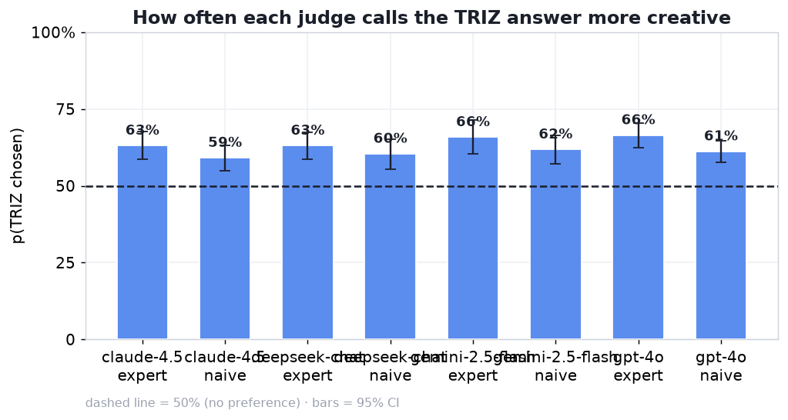

# TRIZ-on vs TRIZ-off — US-patent replication

A second, independent run of the TRIZ creativity study on **patent-derived** engineering
problems, to test whether the textbook-TRIZ result holds on less-canonical problems with
broader solution spaces.

**Bottom line:** it replicates and is slightly stronger. On a blind, bias-controlled,
cross-family LLM jury, TRIZ-prompted solutions to patent problems are judged **more creative
72.2% of the time** (95% CI **[66.2, 77.7]**, clears 50% → significant).

---

## The casebase — `casebase_uspatents.json` (84 cases)

**Source.** [TrizBench](https://github.com/ellenzhuwang/trizbench),
`data/patent_task1_classical_all_text.jsonl` — 116 rows of granted US/GB/EP/WO patents, each
labelled with the TRIZ contradiction it resolved (improving + worsening parameter from the 39,
and the inventive principle(s) from the 40).

**Build.** 116 rows → 107 unique patents (9 duplicate rows). Each problem stem was
**hand-authored** to be:
- **leak-free** — the patented solution/mechanism is withheld; only the problem and its
  contradiction are stated;
- **identifier-stripped** — no patent numbers, company/inventor names ("anti-memorization");
- **contradiction-steered** — written so the gold improving/worsening parameters are the
  natural reading.

The gold `plus_factor_index` / `minus_factor_index` / `principle_index` are carried as
**metadata only** (the 2AFC creativity track scores nothing against them).

**Exclusions (107 → 84):**
- **−21 vehicle-classification / toll cluster** — near-duplicate "classify vehicles passing a
  point, reliably" problems. Kept would be case-level *pseudo-replication*, so the whole
  cluster was dropped.
- **−2** with no usable problem text (GB2303376, US3084213).

Result: **84 genuinely diverse** problems (shock absorbers, candles, scalpels, hearing aids,
pool cleaners, contact lenses, fire detection, escape ladders, …).

---

## Method

Identical pipeline to the main study (`run: us_patents` isolates all artifacts):

- **Generators (4):** `openai/gpt-4o`, `anthropic/claude-sonnet-4.5`,
  `deepseek/deepseek-chat-v3.1`, `google/gemini-2.5-flash`.
- **Arms:** elaborated TRIZ system prompt (40 principles) vs **empty** control. Only the system
  prompt differs; the user message (problem + 120–180-word `FINAL SOLUTION` instruction, TRIZ
  vocabulary forbidden in the visible answer) is identical.
- **Sampling:** k=1, temperature 0.0 (deterministic). Stateless, disk-cached.
- **Provider:** OpenRouter (the main study used the Vercel AI Gateway).
- **Pairs:** 84 × 4 models × k1 → **333 matched pairs** (3 dropped on quality).
- **Jury:** 4 models × 2 personas (expert / naive) = 8 judges, both orders →
  **5,328 judgements** (10 unparsed, 0.2%).
- **Trustworthy subset:** cross-family (judge ≠ generator family) + order-consistent.

---

## Results

### Overall (trustworthy)
**72.2%** TRIZ-preferred, n=1,382, **CI [66.2, 77.7]** — significant.
Pooled over all judgements: 65.1% [61.0, 69.1].

### By judge (all 8 significant)
| Judge | expert | naive |
|---|---|---|
| gpt-4o | 73.9% | 64.6% |
| claude-sonnet-4.5 | 70.4% | 62.6% |
| gemini-2.5-flash | 67.6% | 57.9% |
| deepseek-chat-v3.1 | 62.6% | 60.9% |

Experts prefer TRIZ a little more (Δ +1.7 to +9.7pp), but **naive judges still prefer it**
(57.9–64.6%) — not an expert-jargon artifact.

### By generator (cross-family) — all above 50%
| Generator | p_triz |
|---|---|
| claude-sonnet-4.5 | 73.4% |
| gemini-2.5-flash | 69.2% |
| gpt-4o | 59.5% |
| deepseek-chat-v3.1 | 59.4% |

No model reverses (contrast: the original 10-case run had DeepSeek reversing).

### By problem
Strong case-to-case heterogeneity across the 84 patents.

### Sanity checks
- **No self-preference:** model judging its own output 64.2% vs cross-family 65.4% (cross
  *higher*).
- **Position controlled:** left-pick 45–64%, order-consistency 63–78%; both-orders design
  cancels residual bias in the averages.

---

## Comparison to the main (textbook) study

| | Main (textbook) | **US patents** |
|---|---|---|
| Cases | 45 | 84 |
| Sampling / provider | k=2, temp 0.8, Vercel | k=1, temp 0.0, OpenRouter |
| **Trustworthy p_triz** | **69.8%** | **72.2%** |
| 95% CI | [63.1, 76.0] | [66.2, 77.7] |

The effect **replicates across an independent case set, different sampling, and a different
provider** — strong external validity. It is slightly stronger on patents, which is consistent
with the *substance* reading: on less-canonical problems (broader solution spaces) the TRIZ arm
produces genuinely different, better-judged solutions, not merely more elaborate phrasing.

---

## Limitations

- **Pretraining contamination.** These are real granted patents; models may partly recall the
  actual inventions. Mitigated by leak-free, identifier-stripped stems, but not eliminated —
  contamination would *dilute* (not fake) the effect.
- **Provider difference.** Main ran on Vercel, this on OpenRouter; same model versions where
  available, but flag it when pooling.
- **Creativity only.** Measures judged inventiveness, not practical solution quality.
- **Judge ≠ human.** LLM jury; human validation of these pairs is still open.
- **Authored stems.** Problem descriptions were hand-written from the patents, not the patents'
  own text, so phrasing is the author's.
