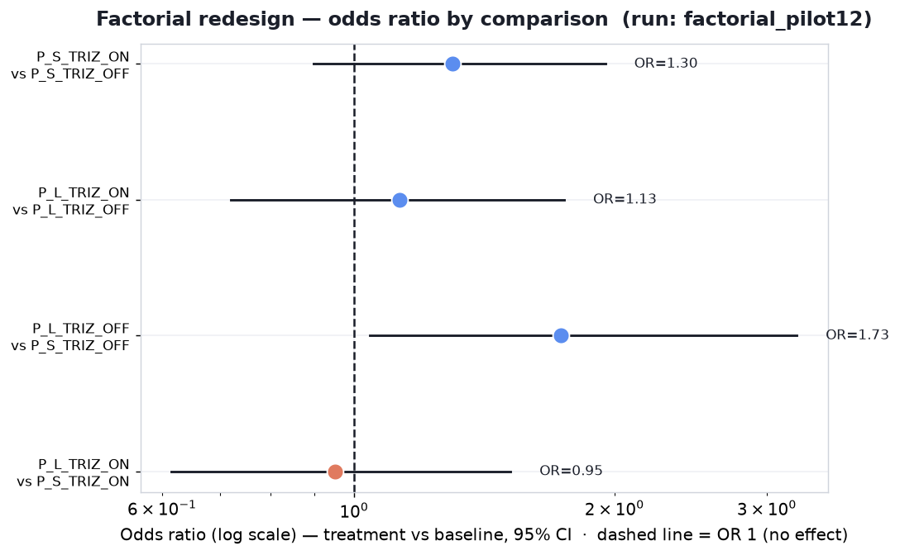

# Factorial pilot — 2×2 (prompt length × TRIZ) confound-controlled redesign (`run: factorial_pilot12`)

First data under the **confound-controlled factorial design**. The earlier studies compared a
long TRIZ prompt against an *empty* control, which conflates TRIZ content with prompt length,
structure, and expert framing. This redesign separates those factors with four generation
conditions and asks the core question (RQ1): **does TRIZ add value beyond generic structured
design prompting?**

**Bottom line (pilot, n=12 cases — read direction, not significance):** the one comparison
that isolates **length/structure with zero TRIZ content is already significant** (63.4%,
OR 1.73, CI [1.04, 3.25]), while both comparisons that isolate **TRIZ-specific content after
matching structure sit near the 50% no-effect line** (53.0% and 48.7%). Early signal:
the original TRIZ-vs-empty-control effect may have been driven substantially by *structured
prompting*, not TRIZ specifically.



---

## Design

### The four generation conditions (the IV — only the system prompt differs)

| Condition | System prompt | Words |
|---|---|---|
| `P_L_TRIZ_ON` | Long TRIZ-expert prompt: 5-step TRIZ method (contradiction → resources → 40 inventive principles → resolve → ideality), principles named but not enumerated | 327 |
| `P_L_TRIZ_OFF` | **Length/structure-matched** generic expert-designer prompt: identical 5-step skeleton, generic "design tactics" vocabulary, zero TRIZ terms | 330 |
| `P_S_TRIZ_ON` | *"Use TRIZ to solve the following engineering problem."* | 8 |
| `P_S_TRIZ_OFF` | *"Solve the following engineering problem."* (the baseline) | 5 |

All four share the identical user message (`prompts/user_template.txt`): task + 120–180-word
`FINAL SOLUTION:` section, TRIZ vocabulary forbidden in the visible answer.

### The four comparisons (the interpretable simple effects of the 2×2)

The two conflated diagonals are intentionally omitted.

| Comparison | Question answered | Baseline |
|---|---|---|
| `P_S_TRIZ_ON` vs `P_S_TRIZ_OFF` | Does the TRIZ keyword help in short prompts? | `P_S_TRIZ_OFF` |
| `P_L_TRIZ_ON` vs `P_L_TRIZ_OFF` | Does TRIZ help beyond matched long structure? | `P_L_TRIZ_OFF` |
| `P_L_TRIZ_OFF` vs `P_S_TRIZ_OFF` | Does long generic structure help? | `P_S_TRIZ_OFF` |
| `P_L_TRIZ_ON` vs `P_S_TRIZ_ON` | Does the full TRIZ scaffold help beyond the short TRIZ mention? | `P_S_TRIZ_ON` |

### Evaluation

- **Single TRIZ-blind evaluator** (`prompts/factorial/E_TRIZ_OFF.txt`): purely criterion-based
  2AFC — originality, usefulness, feasibility, specificity, elegance. **No persona, no mention
  of TRIZ anywhere in the evaluator** (the old "you have never heard of TRIZ" naive persona was
  dropped — negated mentions still activate the concept).
- 4 judge models × both A/B orders per pair.
- **Trustworthy subset** = cross-family (judge ≠ generator family) + order-consistent, same
  convention as the prior studies.
- Odds ratios with 95% CIs from a **case-clustered bootstrap** (resamples cases, not raw
  judgements — judgements within a case are not independent).

### Sample

- **12 cases**, stratified 7 textbook + 5 patent-derived, chosen for domain diversity:
  `001` (river-bank erosion), `002` (scooter stability), `009` (aircraft thermal stress),
  `013` (photochromic lenses), `016` (glass ampoules), `022` (elevator hoist),
  `026` (drug delivery), `P02` (diamond splitting), `P04` (submarine rescue),
  `P08` (radar antenna), `P09` (avalanche rescue), `P16` (gold-chain soldering).
- **Generators (4):** `openai/gpt-4o`, `anthropic/claude-sonnet-4.5`,
  `deepseek/deepseek-chat-v3.1`, `google/gemini-2.5-flash`. k=1, temperature 0.0 (deterministic).
  Provider: OpenRouter.
- **Volume:** 192 generations (0 errors) → **188 pairs** (98% quality-filter survival; 4 drops,
  all `P_L_TRIZ_ON` leaking the word "contradiction") → **1,504 judgements** (1,500 usable,
  4 unparsed) → **295 trustworthy**.

---

## Results

### Main table — % of trustworthy judgements picking the treatment arm

| Comparison | Baseline | n | % treatment picked | OR | 95% CI (OR) | |
|---|---|---|---|---|---|---|
| `P_S_TRIZ_ON` vs `P_S_TRIZ_OFF` | `P_S_TRIZ_OFF` | 69 | 56.5% | 1.30 | [0.90, 1.95] | n.s. |
| `P_L_TRIZ_ON` vs `P_L_TRIZ_OFF` | `P_L_TRIZ_OFF` | 66 | 53.0% | 1.13 | [0.72, 1.75] | n.s. |
| `P_L_TRIZ_OFF` vs `P_S_TRIZ_OFF` | `P_S_TRIZ_OFF` | 82 | **63.4%** | **1.73** | **[1.04, 3.25]** | **significant** |
| `P_L_TRIZ_ON` vs `P_S_TRIZ_ON` | `P_S_TRIZ_ON` | 78 | 48.7% | 0.95 | [0.62, 1.52] | n.s. |

**Reading:**
- **Structure alone works.** The long generic prompt beats the short baseline (63.4%) — the only
  contrast significant at this sample size, despite it containing no TRIZ content at all.
- **TRIZ-specific content adds no detectable value once structure is matched** (53.0%), and the
  full TRIZ scaffold does not beat the bare TRIZ keyword (48.7%).
- The bare TRIZ keyword shows a weak positive lean in short prompts (56.5%, n.s.).

### By comparison × generator model (small cells — noisy, expected at n=12)

| Generator | `P_S_ON` vs `P_S_OFF` | `P_L_ON` vs `P_L_OFF` | `P_L_OFF` vs `P_S_OFF` | `P_L_ON` vs `P_S_ON` |
|---|---|---|---|---|
| claude-sonnet-4.5 | 42.9% (n=14) | 50.0% (n=14) | 77.8% (n=18) | 81.2% (n=16) |
| deepseek-chat-v3.1 | 65.0% (n=20) | 66.7% (n=18) | 61.9% (n=21) | 34.8% (n=23) |
| gemini-2.5-flash | 35.0% (n=20) | 35.0% (n=20) | 59.1% (n=22) | 55.6% (n=18) |
| gpt-4o | 86.7% (n=15) | 64.3% (n=14) | 57.1% (n=21) | 33.3% (n=21) |

Models disagree at these cell sizes (n≈14–23); only the structure contrast (column 3) is
directionally consistent across all four generators.

### Position sanity

| Judge | left-pick rate | order-consistency |
|---|---|---|
| gemini-2.5-flash | 53.2% | 58.1% |
| gpt-4o | 57.3% | 52.4% |
| claude-sonnet-4.5 | 40.5% | 51.3% |
| deepseek-chat-v3.1 | 63.8% | 50.0% |

⚠️ **Watch item:** order-consistency (50–58%) is noticeably lower than the old two-persona
design (63–78%). The single criterion-based evaluator flips its verdict between A/B orders more
often, so a larger share of judgements is discarded from the trustworthy subset. Worth one
iteration on the evaluator prompt before scaling up — higher consistency = more usable
judgements per dollar.

---

## Interpretation & caveats

1. **This is a pilot.** n=12 cases; CIs are wide by design. Read direction and magnitude, not
   significance stars. "Not significant" here means *no signal detected yet*, not *proven zero*:
   the [0.72, 1.75] interval on the long-TRIZ contrast still admits a real but modest effect.
2. **The coherent pattern is the story:** the one significant contrast is exactly the one that
   isolates structure with no TRIZ, and both TRIZ-isolating contrasts sit at ~49–53%. This is
   the direction predicted by the confound critique that motivated the redesign.
3. **Power at full scale:** scaling to all 45 cases (~1.9× narrower CIs) will cleanly resolve
   the structure effect and probably the short-keyword effect. If the true long-TRIZ effect is
   ~53%, however, even 45 cases will straddle 50% — detecting a 3-point effect needs ~200+ cases.
   A tight null on that contrast is itself a valid, publishable finding for RQ1.
4. **Comparison to prior (confounded) studies:** `main` v1 69.8% [63.1, 76.0], `main` v2 (+CrPO)
   68.2% [62.4, 73.4], `us_patents` 72.2% [66.2, 77.7] — all long-TRIZ vs *empty* control. The
   pilot suggests a substantial share of those effects may be attributable to prompt
   length/structure rather than TRIZ content; the full factorial run will quantify the split.

---

## Reproduce

```bash
# config.yaml:  run: factorial_pilot12, casebase: casebase_factorial_pilot12.json,
#               prompt_dir: factorial, conditions: [P_L_TRIZ_ON, P_L_TRIZ_OFF, P_S_TRIZ_ON, P_S_TRIZ_OFF]
uv run python src/generate.py --concurrency 10
uv run python scripts/build_pairs.py
uv run python src/judge.py --concurrency 10
uv run python src/factorial_report.py --run factorial_pilot12
```
