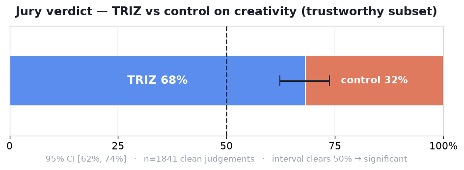
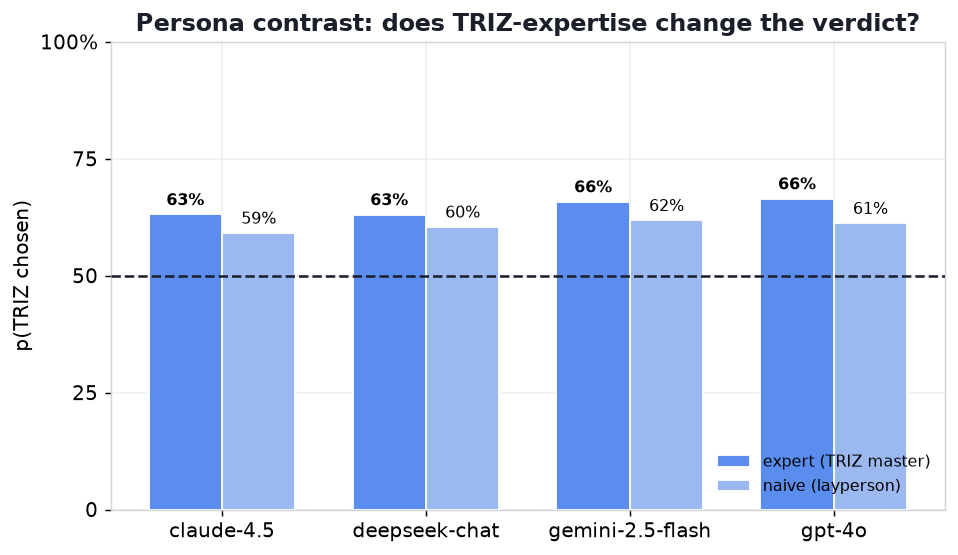
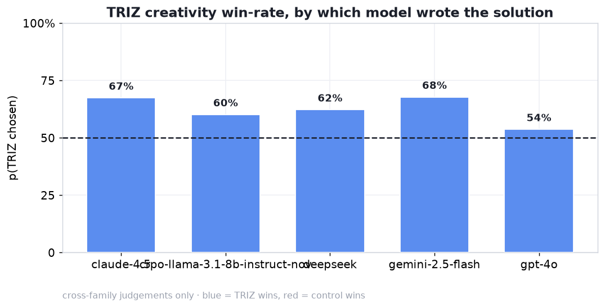
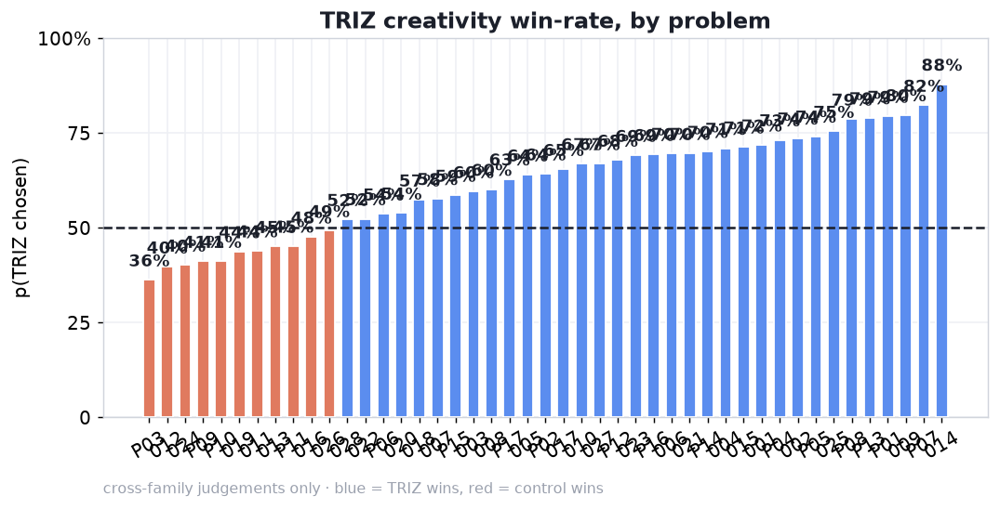
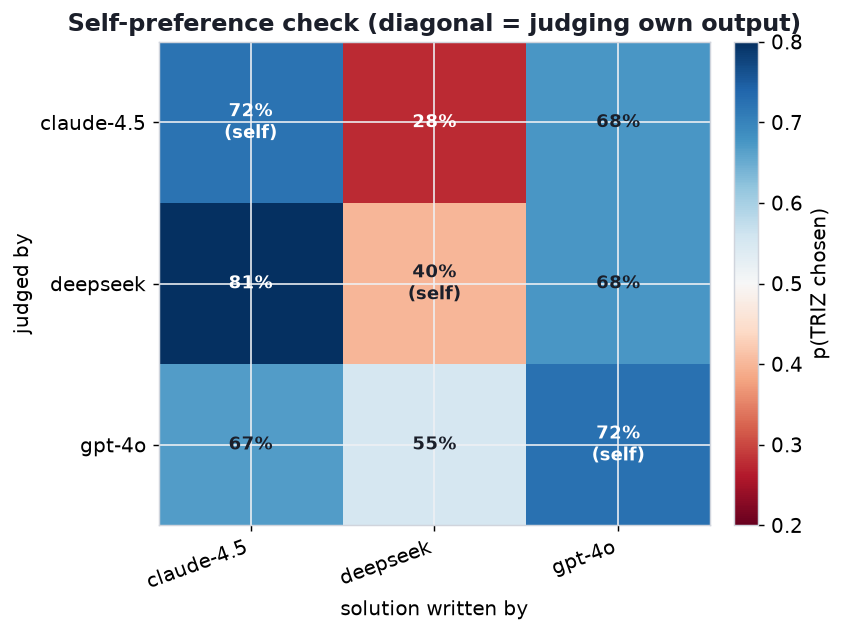

# TRIZ-on vs TRIZ-off — textbook study (`run: main`)

The primary run of the TRIZ creativity study, on **45 classic textbook** engineering
problems (the Altshuller/Petrov TRIZ lineage). Does priming a model with a TRIZ system
prompt make its solutions more creative than the same model with no system prompt?

**Bottom line:** yes. On a blind, bias-controlled, cross-family LLM jury, TRIZ-prompted
solutions are judged **more creative 69.8% of the time** (95% CI **[63, 76]**, clears
50% → significant).

> This is the textbook run. For the independent patent-derived replication, see
> [`../us_patents/README.md`](../us_patents/README.md) (72.2%). The framework and how to
> reproduce either run are documented in the repository's top-level `README.md` and
> `AGENTS.md`.

---

## The casebase — `casebase.json` (45 cases)

Classic TRIZ contradiction problems drawn from the textbook literature (Altshuller,
Petrov, Orloff and related sources), each labelled with its gold contradiction
(improving/worsening parameter and inventive principle) as **metadata only** — the 2AFC
creativity track scores nothing against the labels. The generator sees the problem
statement and nothing else (the leak rule).

---

## Method

- **Generators (4):** `openai/gpt-4o`, `anthropic/claude-sonnet-4.5`,
  `deepseek/deepseek-v3.1`, `google/gemini-2.5-flash`.
- **Arms:** an elaborated TRIZ system prompt (the 40 inventive principles) vs an **empty**
  control. Only the system prompt differs; the user message (problem + a 120–180-word
  `FINAL SOLUTION` instruction, TRIZ vocabulary forbidden in the visible answer) is
  identical across arms.
- **Sampling:** k=2 at temperature 0.8 (captures within-arm stochastic variance).
  Stateless, disk-cached. Provider: Vercel AI Gateway.
- **Pairs:** ~327 matched TRIZ-vs-control pairs (quality-filtered).
- **Jury:** 4 models × 2 personas (expert / naive) = 8 judges, both A/B orders →
  **5,229 judgements**.
- **Trustworthy subset:** cross-family (judge ≠ generator family) + order-consistent.

---

## Results

### Overall (trustworthy)
**69.8%** TRIZ-preferred, n=1,227, **CI [63, 76]** — significant.
Pooled over all judgements: **63.5%** (n=5,229).

### By judge (all lean TRIZ; experts a little more)
| Judge | expert | naive |
|---|---|---|
| gpt-4o | 67.5% | 60.9% |
| claude-sonnet-4.5 | 65.6% | 59.9% |
| gemini-2.5-flash | 65.4% | 62.0% |
| deepseek-v3.1 | 64.5% | 61.8% |

Even the **naive** (layperson) judges, with no idea what TRIZ is, prefer the TRIZ answers
(~60–62%) — so it is not an artefact of an expert judge rewarding TRIZ-flavoured language.

### By generator (cross-family) — all above 50%
| Generator | p_triz |
|---|---|
| gemini-2.5-flash | 69.0% |
| claude-sonnet-4.5 | 67.6% |
| deepseek-v3.1 | 62.2% |
| gpt-4o | 53.5% |

TRIZ lifts every generator, though only barely for GPT-4o. (In the earlier 10-case pilot
DeepSeek *reversed*; at 45 cases no model reverses.)

### By problem
Strong case-to-case heterogeneity across the 45 problems.

### Sanity check: self-preference is small and controlled for
A model judging its **own** output prefers TRIZ 65.9% vs 62.6% when judging **others'** — a
small **~3pp** self-preference. The headline uses **only cross-family** votes, so the
reported effect is not driven by models flattering themselves.

---

## Comparison to the patent replication

| | **Textbook** (`main`) | Patents (`us_patents`) |
|---|---|---|
| Cases | 45 | 84 |
| Sampling / provider | k=2, temp 0.8, Vercel | k=1, temp 0.0, OpenRouter |
| **Trustworthy p_triz** | **69.8%** | **72.2%** |
| 95% CI | [63, 76] | [66, 78] |

The effect **replicates across an independent case set, different sampling, and a different
provider** — strong external validity.

---

## Limitations

- **Creativity only.** Measures judged inventiveness, not practical solution quality. An
  earlier "which solves the problem better?" run was ~50%, so the claim is specifically
  about *creativity*.
- **Judge ≠ human.** LLM jury; human validation of these pairs is still open.
- **Residual position bias.** The both-orders design cancels it in the averages, but the
  judges are imperfect instruments.
- **Model/version specific.** Tied to these four model versions and this particular TRIZ
  prompt phrasing.
