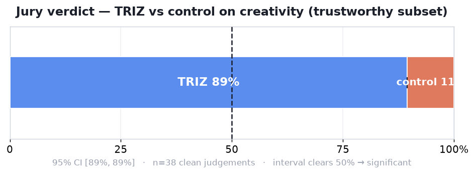
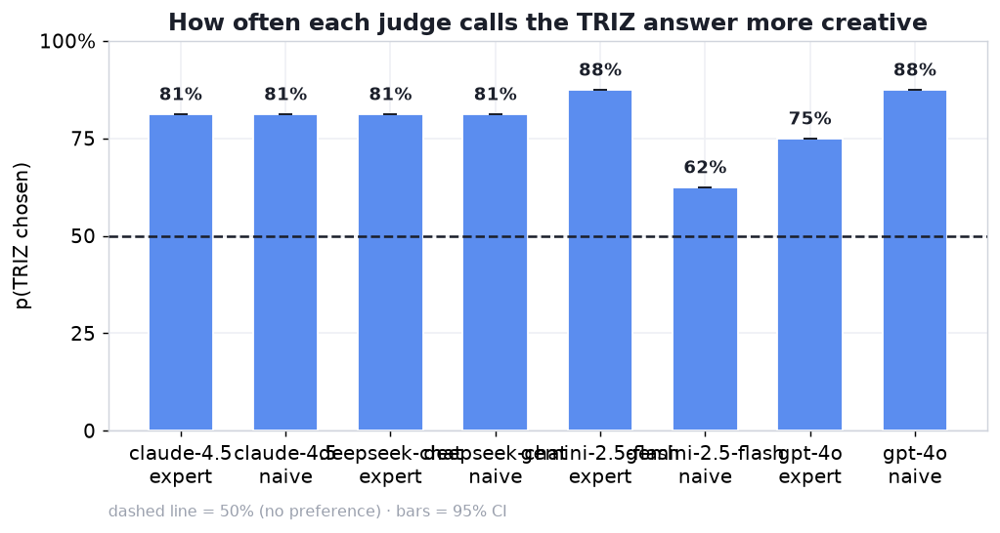
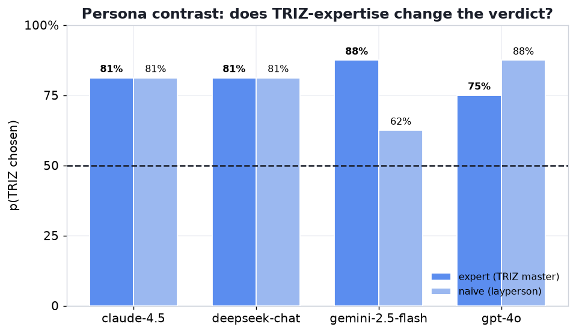
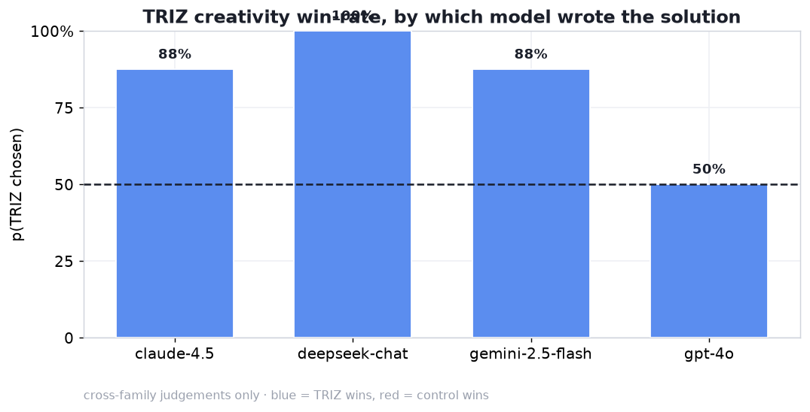
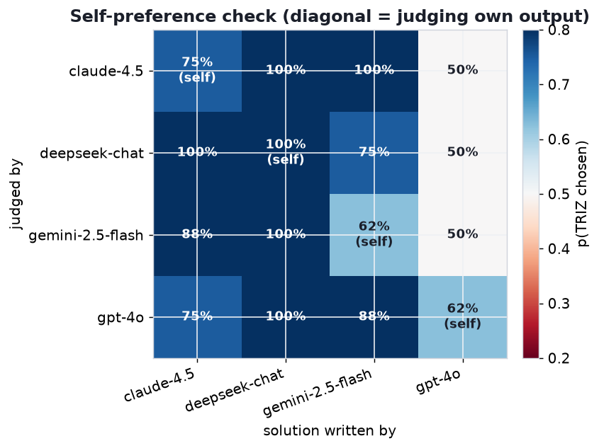

# TRIZ-on vs TRIZ-off — single-case probe: ELEC-042 (PC-mouse / RSI)

An **isolated, single-problem** probe of the TRIZ creativity effect on a hard consumer-hardware
contradiction: the ergonomic computer-input problem (repetitive strain vs. input throughput).
Run separately from the `main` (textbook) and `us_patents` casebases.

**Bottom line:** on this one problem, TRIZ-prompted solutions were judged **more creative in
~80–90% of blind comparisons** across 4 generator models and 8 judges. This is a strong,
consistent *qualitative* signal — **not** a statistical claim (see the caveat below: with a
single case there is no meaningful confidence interval).

---

## The problem — `casebase_pc_mouse.json` (1 case)

**ELEC-042 — Ergonomic Input Contradiction (RSI).** Consumer hardware / HCI.

> Knowledge workers rely heavily on standard keyboards and mice for extended periods, causing
> carpal tunnel and repetitive strain injuries. **Contradiction:** to keep high input throughput
> and spatial precision the user must make rapid, repetitive finger/wrist movements; but to
> eliminate neuromuscular strain those same micro-movements and static joint loads must be
> minimized or removed. **Constraints:** OS-backward-compatible (no input lag), no surgical
> implantation, standard desk footprint.

The generator sees only this problem statement (the leak rule); no solution is provided.

---

## Method

Identical pipeline to the other runs (`run: pc_mouse` isolates all artifacts):

- **Generators (4):** `openai/gpt-4o`, `anthropic/claude-sonnet-4.5`, `deepseek/deepseek-chat-v3.1`,
  `google/gemini-2.5-flash`.
- **Arms:** elaborated TRIZ system prompt (40 principles) vs **empty** control. Only the system
  prompt differs; the user message (problem + 120–180-word `FINAL SOLUTION`, TRIZ vocabulary
  forbidden in the visible answer) is identical.
- **Sampling:** **k=2, temperature 0.8** (two samples per model/arm, to see how consistent the
  effect is on this one problem). Provider: OpenRouter.
- **Pairs:** 1 case × 4 models × k2 → **8 matched pairs** (0 dropped on quality).
- **Jury:** 4 models × 2 personas (expert / naive) = 8 judges, both A/B orders → **128 judgements**
  (0 unparsed).
- **Trustworthy subset:** cross-family (judge ≠ generator family) + order-consistent.

---

## Results

### Overall
| Metric | p(TRIZ chosen) | n |
|---|---|---|
| **Trustworthy** (cross-family + order-consistent) | **89.5%** | 38 |
| Cross-family pooled | 81.2% | 96 |
| All judgements pooled | 79.7% | 128 |

### By judge (all 8 lean TRIZ)
| Judge | expert | naive |
|---|---|---|
| gpt-4o | 75.0% | 87.5% |
| claude-sonnet-4.5 | 81.2% | 81.2% |
| gemini-2.5-flash | 87.5% | 62.5% |
| deepseek-chat-v3.1 | 81.2% | 81.2% |

Both expert and naive personas prefer the TRIZ answers.

### By generator (cross-family)
| Generator | p_triz |
|---|---|
| deepseek-chat-v3.1 | 100.0% |
| claude-sonnet-4.5 | 87.5% |
| gemini-2.5-flash | 87.5% |
| gpt-4o | 50.0% |

Three of four models get a large TRIZ lift on this problem; **GPT-4o is the exception** — its
TRIZ and control mouse solutions were judged equally creative (50%).

### Sanity check: no self-preference
Model judging its **own** output prefers TRIZ 75.0% vs 81.2% when judging **others'** (cross is
*higher*), so the effect is not self-flattery.

---

## ⚠️ Statistical caveat — read this before quoting a number

The stats report prints `CI [89.5, 89.5]` and a `*` significance marker. **Disregard both.** The
confidence interval comes from a **case-clustered bootstrap** that resamples *cases*; with **one
case** every resample is identical, so the interval collapses to a point and the significance test
is meaningless.

What can be said honestly: *"On this ELEC-042 ergonomic-mouse problem, TRIZ-prompted solutions were
judged more creative in roughly 80–90% of blind comparisons across 4 models and 8 judges."* A
strong, consistent signal **on this problem** — not evidence about engineering problems in general.

To turn this into a real result, ELEC-042 becomes one row in a small "hard engineering /
consumer-hardware" casebase (~15–30 problems); the cross-case bootstrap then yields a meaningful CI,
as in the `main` (69.8% [63, 76]) and `us_patents` (72.2% [66, 78]) runs.

---

## Human validation

The matched pairs for this problem are loaded into the sibling **2AFC game**
(`triz-2afc-game`) for blind human rating, so the LLM-jury verdict on ELEC-042 can be checked
against human raters.
